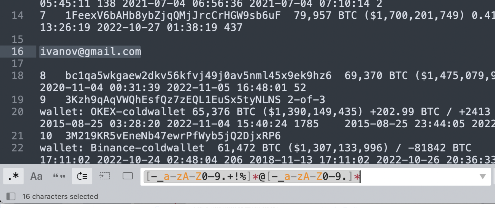

  
    <h1>Regex for OSINT</h1>
   
   

   A list of application tools and information resources to help you effectively use regular expressions in OSINT (Open Source Intelligence)
  

  
   
      
    
  [@cyb_detective](https://linktr.ee/cyb_detective)
    

 If you are serious about OSINT but do not yet use regular expressions in your practice, I recommend that you read this article to realize all the amazing possibilities this technology offers:
 
 [How regular expressions can be useful in OSINT. Theory and some practice using Google Sheets](https://medium.com/@cyb_detective/this-article-consists-of-three-short-parts-31d31efabd5)
 
 

## Table of contents

  - [Best Regex Cheatsheets](#best-regex-cheatsheets)
  - [Regex online courses](#regex-online-courses)
  - [Regex Lists and Libraries](#regex-lists-and-libraries)
  - [Regex generators and constructors](#regex-generators-and-constructors)
  - [Understanding regex](#understanding-regex)
     
  - [Command line tools for searching and extracting data with regex](#command-line-tools-for-searching-and-extracting-data-with-regex)
  - [Text editors with regex support](#text-editors-with-regex-support)
  - [Search engines with regex support](#search-engines-with-regex-support)
  - [Examples of OSINT tools with regex support](#examples-of-osint-tools-with-regex-support)
  - [Google Chrome Extensions for searching and extracting data with regex](#google-chrome-extensions-for-searching-and-extracting-data-with-regex)
  
 
 

  
 # Theory 
  
  ## Best Regex Cheatsheets
| Link                                    | Description                                                                        | 
| --------------------------------------- | ---------------------------------------------------------------------------------- |
|  [Devhints](https://devhints.io/regexp) | Simple universal regex cheatsheet|
|  [Remram44 Cheatsheet](https://remram44.github.io/regex-cheatsheet/regex.html) | for Perl/PCR, Python's re, POSIX (BRE), POSIX extended (ERE)and Vim regex|
|  [DaveChild Regex Cheatsheet](https://cheatography.com/davechild/cheat-sheets/regular-expressions/) | Posted on Cheatography cheatsheet with downloadable PDF version. |

## Regex online courses
 
| Link                                    | Description                                                                        | 
| --------------------------------------- | ---------------------------------------------------------------------------------- |
|  [Regex Learn](https://regexlearn.com/learn/) | Complete 56 short online exercises and learn how to use regular expressions. |
|  [Regex One](https://regexone.com/) | 25 lessons with interactive exercises |

  
  ## Regex Lists and Libraries
  
| Link                                    | Description                                                                        | 
| --------------------------------------- | ---------------------------------------------------------------------------------- |
|  [UI Bakery Regex Library](https://uibakery.io/regex-library) | A short list of a couple dozen of the most useful and widely used regular expressions.|
|  [Regex101](https://regex101.com/library) |16000+ regular expressions + editor/debugger with quick reference |
|  [XRegexp](https://xregexp.com) |JavaScript regular expressions library |
|  ["Secret regex list"](https://github.com/h33tlit/secret-regex-list) | List of regular expressions to search for API keys and other juicy info. Useful when searching in public  code repositories as well as when researching files on the computer/server that is your target.|
|  [Stackoverflow regex tag](https://stackoverflow.com/questions/tagged/regex) | 250 000 + questions with examples of regex |    

<b>Important:</b>

If you happen to find some regular expression on the Internet and it doesn't work, check its compatibility with the application or programming language you are using. All the differences between the different types of regular expressions (PCRE, JavaScript, Python, POSIX ERE, etc.) are described in detail [here](https://www.regular-expressions.info/refbasic.html)

## Regex generators and constructors
| Link                                    | Description                                                                        | 
| --------------------------------------- | ---------------------------------------------------------------------------------- |
|  [Autoregex](https://www.autoregex.xyz/) | A tool that generates regular expressions against a verbal description using AI|
|  [GREX](https://github.com/pemistahl/grex) | Command line tool written by Rust that generates a regular expression corresponding to entered string. There are dozens of different options, each of which can produce completely different results. |
|  [RegexpConstructor](https://bablosoft.github.io/RegexpConstructor/#!/input) | Online tool for creating regular expressions based on typed string. Very little automation, very many options and settings. The result depends almost entirely on the user's effort. |
|  [Regular expression builder](https://drdoane.com/regular-expression-builder/) | Online tool for writing regular expressions by selecting values and parameters from a drop-down list. |
|  [Strings to regex](https://www.wimpyprogrammer.com/strings-to-regex/) | Generates a regular expression matching a long list of string values. |

## Understanding regex
 
| Link                                    | Description                                                                        | 
| --------------------------------------- | ---------------------------------------------------------------------------------- |
|  [Regex Translator](https://www.regextranslator.com/) | An online tool that generates a text description for any regular expression |
|  [Stanford regex analyzer](http://xenon.stanford.edu/~xusch/regexp/) | Another online tool that generates a text description for any regular expression |
|  [Regexper](https://regexper.com/) | A tool that converts a regular expression into a block diagram |
|  [Extend Class Regex Visualizer](https://extendsclass.com/regex-tester.html) | Test, debug and visaulize regex online  |

# Practice

<b>Important:</b> Regular expressions are supported by a huge number of applications. Even Google Docs and Adobe Photoshop (in JavaScript automations) support them. Before you install any new application to use regular expressions, think about whether you can use something you already have.

## Command line tools for searching and extracting data with regex
| Link                                    | Description                                                                        | 
| --------------------------------------- | ---------------------------------------------------------------------------------- |
|  [FD](https://github.com/sharkdp/fd) | Written in Rust analog of the standard Linux <b>find</b> utility. Faster and more User friendly |
|  [SD](https://github.com/chmln/sd) | Written in Rust analog of the standard Linux <b>sed</b> utility. Faster and more User friendly |
|  [Awesome GREP](https://github.com/cipher387/awesome-grep) | A list of various tools for working with different file types that have similar functionality to the standard Linux <b>grep</b> utility |
|  [VIM](http://vimregex.com/) |The most powerful command line text editor with many functions for working with regular expressions. |
|  [AWK](https://www.gnu.org/software/gawk/manual/gawk.html) |AWK is a domain-specific language designed for text processing and typically used as a data extraction and reporting tool |

## Text editors with regex support
| Link                                    | Description                                                                        | 
| --------------------------------------- | ---------------------------------------------------------------------------------- |
|  [Notepad++](https://npp-user-manual.org/docs/searching/) | |
|  [Sublime Text](https://sublime-text-unofficial-documentation.readthedocs.io/en/latest/search_and_replace/search_and_replace_overview.html) | |
|  [Edit Pad](https://www.regular-expressions.info/editpadlite.html) | |
|  [Atom](http://2017.compciv.org/guide/topics/end-user-software/atom/how-to-use-regex-atom.html) | |
|  [Visual Studio](https://learn.microsoft.com/en-us/visualstudio/ide/using-regular-expressions-in-visual-studio?view=vs-2022) | |

## Search engines with regex support
| Link                                    | Description                                                                        | 
| --------------------------------------- | ---------------------------------------------------------------------------------- |
|  [Public WWW](https://publicwww.com/) |Source Code Search Engine. Find any alphanumeric snippet, signature or keyword in the web pages HTML, JS and CSS code. |
|  [Grep.app](https://grep.app/) | Search across half of million Github repos |
|  [NetlasIO](https://netlas.io/) |Search service for all devices connected to the Internet. You can search by IP addresses, port, protocols, certificates, vulnerability names and other parameters. |
|  [Sourcegraph](https://learn.sourcegraph.com/how-to-search-with-sourcegraph-using-regular-expression-patterns) | Source code search engine |
|  [Live Grep](https://github.com/livegrep/livegrep) | Search across Github repos |

## Examples of OSINT tools with regex support
| Link                                    | Description                                                                        | 
| --------------------------------------- | ---------------------------------------------------------------------------------- |
|  [WayMore](https://github.com/xnl-h4ck3r/waymore) | Search archived links to domain in Wayback Machine and Common Crawl (+ Urlscan and Alien Vault OTX). Very extensive options for filtering search results by keywords (using Regexp), date and time, and other parameters. |
|  [Secret Finder](https://github.com/m4ll0k/SecretFinder) | Tool for find sensitive data (apikeys, accesstoken,jwt,..) or search anything with #regexp on #javascript files. |
|  [DumpsterDiver](https://github.com/securing/DumpsterDiver) | Tool can analyze big volumes of data and find some "secrets" in the files (passwords and hardcoded password, SSH, Azure and AWS keys etc). Uncompress archived files, support regular expressions and advanced search rules. |
|  [Rextract](https://github.com/iustin24/rextract) | This extreme simple tool extracts the strings corresponding to a certain #regex  from the html code of the list of URLs. |
|  [GREP for OSINT](https://github.com/cipher387/grep_for_osint) |Set of very simple shell scripts that will help you quickly analyze a text or a folder with files for data useful for investigation (phone numbers, bank card numbers, URLs, emails and nicknames). |

## Google Chrome Extensions for searching and extracting data with regex
| Link                                    | Description                                                                        | 
| --------------------------------------- | ---------------------------------------------------------------------------------- |
|  [Regex Checker](https://chrome.google.com/webstore/detail/regex-checker/gkcnkoebkkppbapcjifgokmpcflfhbde) |Search and highlight (in webpage): Emails, Phone numbers, Dates, Prices, Adresses |
|  [find+](https://chrome.google.com/webstore/detail/find%2B-regex-find-in-page/fddffkdncgkkdjobemgbpojjeffmmofb) |Regex Find-in-Page Tool |
|  [Chrome regex search](https://chrome.google.com/webstore/detail/chrome-regex-search/bpelaihoicobbkgmhcbikncnpacdbknn) | Dynamically highlight regex matches on the web page |

Don't forget to follow [@cyb_detective](https://linktr.ee/cyb_detective)
    
